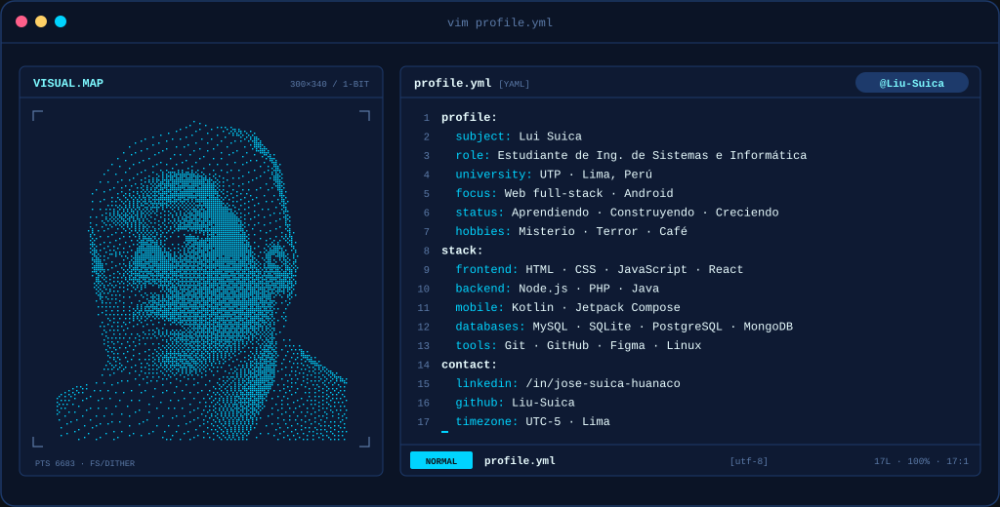
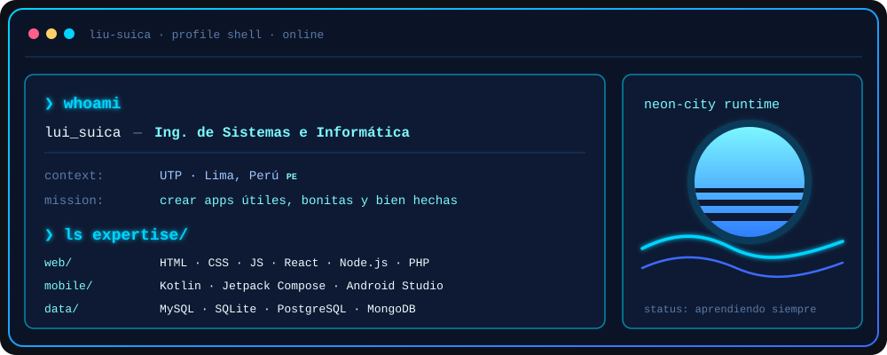
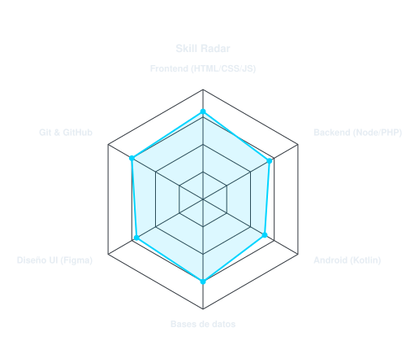
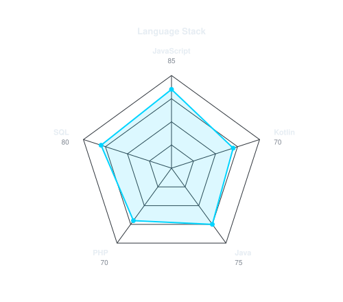

---

## `$ whoami`

  

<h2 align="center"><code>$ cat tech-stack.yaml</code></h2>

<table align="center">
  <tr>
    <td colspan="2"><code>liu-suica:~$ cat tech-stack.yaml</code></td>
  </tr>
  <tr>
    <td valign="top" width="50%">
      <code>├─ ✦ languages:</code>  
       
      <code>JavaScript · TypeScript · Java · Kotlin · PHP</code>
    </td>
    <td valign="top" width="50%">
      <code>├─ ◇ web_frontend:</code>  
       
      <code>HTML · CSS · React · Next.js · Bootstrap</code>
    </td>
  </tr>
  <tr>
    <td valign="top">
      <code>├─ ⚙ backend_apis:</code>  
      
       
      <code>Node.js · Express · NestJS · XAMPP</code>
    </td>
    <td valign="top">
      <code>├─ ▣ mobile_android:</code>  
      
       
      <code>Kotlin · Jetpack Compose · Android Studio</code>
    </td>
  </tr>
  <tr>
    <td valign="top">
      <code>├─ ◉ databases:</code>  
       
      <code>MySQL · SQLite · PostgreSQL · MongoDB</code>
    </td>
    <td valign="top">
      <code>╰─ ⌁ tools_design:</code>  
       
      <code>Git · GitHub · Linux · VS Code · Figma</code>
    </td>
  </tr>
  <tr>
    <td colspan="2"><code>status: learning  ·  environment: neon-city</code></td>
  </tr>
</table>

---

## `$ scan --signals --all`

  
  

<code>signals: skill_radar · language_stack · status: growing</code>

---

## `$ connect --socials`

  

Hecho con 💙 y mucho café desde Lima, Perú · @Liu-Suica

